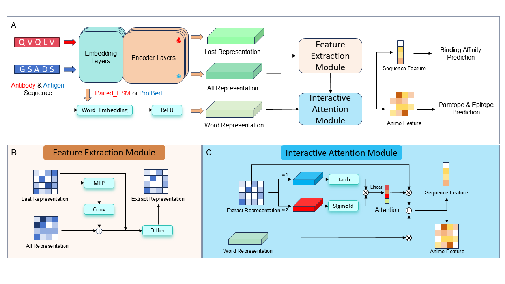

# AAIL: An Interaction-Aware Language Model for Accurate Prediction of Antibody-Antigen Binding

This repository contains the official implementation and data for the paper: **"AAIL: An interaction-aware language model for accurate prediction of antibody-antigen binding interfaces and affinity"**.

AAIL is a dual-encoder deep learning framework designed to predict the outcomes of antibody-antigen interactions directly from their sequences. It incorporates a novel fine-tuning architecture to achieve state-of-the-art performance on multiple benchmark tasks.

 

## Key Features

- **State-of-the-Art Performance**: Achieves top results on paratope/epitope prediction, large-scale virtual screening, and binding affinity regression.
- **Interaction-Aware Architecture**: Employs specialized Feature Extraction and Interactive Attention modules to pinpoint critical binding residues.
- **Sequence-Only Input**: Requires only antibody and antigen sequences, bypassing the need for 3D structures.
- **Pre-trained Models & Datasets**: Provides pre-trained antibody language models and the benchmark dataset to facilitate future research.

## Installation

We recommend using `conda` to manage the environment.

1.  **Clone the repository:**
    ```bash
    git clone https://github.com/storynq/AAIL.git
    cd AAIL
    ```

2.  **Download pretrained models, datasets, and environment:**
    We provide the pretrained antibody language model checkpoint, pretrained datasets, and packed environment used in our study at this link: 10.5281/zenodo.19364855


3.  **Create and activate the environment from the :**
    ```bash
    tar -zxvf env.tar.gz ./your_env_file
    source ./your_env_file/env/bin/activate
    ```

## Usage

The `code/` directory contains scripts for pre-training and running the three downstream tasks.

### 1. Paratope & Epitope Prediction

To predict binding interfaces(paratope & epitope) on the B-cell benchmark dataset:

```bash
python code/AAIL_paratope.py
```

### 2. Large-Scale Screening 

To evaluate the model on the large screening test set:

```bash
python code/AAIL_screening.py
```

### 3. Binding Affinity Prediction

To predict binding affinity on the BioMap dataset:

```bash
python code/AAIL_biomap.py
```

## Pre-training

The script for pre-training the antibody language model on the OAS database is also provided. The pretraining dataset needs to be downloaded: 10.5281/zenodo.19364855

```bash
python code/AAIL_Pretrain.py
```
